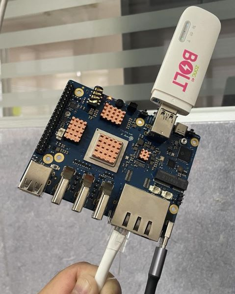

# Make Edge Computing Node with Resolvable on 3G/4G Networks



## Burn Armbian
- Using `balenaEtcher` program (Run as administrator on Windows)
- [option] If want to boot with NVMe, you must boot with SD Card first and run `armbian-config` to overide bootloader
- tested on `Orange Pi 5 Plus` and `Radxa Rock5B`

## First Boot
- You need to connect with a monitor and a keyboard via HDMI (or USB-C with DP Support)
- run `armbian-config` for update kernel and firmware
- run `apt update && apt upgrade -y` for update sofwares
- run `armbian-config` to install desired softwares (suggest: `docker` and `yggdrasil`)
- edit `/boot/armbianEnv.txt` add `extraargs=net.ifnames=0` to change interfaces to common name
- Ready to customized!

## Add Huawei Modem (Tested on E8372, 12d1:155e)
- run `apt install usb-modeswitch usb-modeswitch-data`
- edit `HuaweiAltModeGlobal=1` inside `/etc/usb_modeswitch.conf`
<!-- - [no-need] add file `/etc/udev/rules.d/70-huawei_e8372.rules` with content
```
ACTION=="add", SUBSYSTEM=="usb", ATTRS{idVendor}=="12d1", ATTRS{idProduct}=="1f01", RUN+="/usr/sbin/usb_modeswitch -v 12d1 -p 1f01 -M '55534243123456780000000000000a11062000000000000100000000000000'"

ACTION=="add", SUBSYSTEM=="usb", ATTRS{idVendor}=="12d1", ATTRS{idProduct}=="1f01", RUN+="/bin/bash -c 'modprobe option && echo 12d1 14db > /sys/bus/usb-serial/drivers/option1/new_id'"
``` -->

- add file `/etc/usb_modeswitch.d/12d1:155e` with content
```
TargetVendor=0x12d1
TargetProduct=0x155e
MessageContent="55534243123456780000000000000011063000000100010000000000000000"
HuaweiNewMode=1
```

- run `dmesg` to see the system log, some line should be
```
... register 'cdc_ether' at usb-xhci-hcd.10.auto-1.4, CDC Ethernet Device
```

## Act like router
- If outbound internet as `eth2` and you want to create DHCP Server (192.168.100.0/24) on bridged network `br0` between `eth0` and `eth1` and forward internet
- install `bridge-utils` (pre-installed in armbian)
- edit `/etc/network/interfaces` to create `br0` interface and assign GATEWAY IP for clients
```
...

# Set manual configure for eth0 and eth1
iface eth0 inet manual
iface eth1 inet manual

# Bridge setup
auto br0
iface br0 inet static
    pre-up { brctl addbr br0 && brctl addif br0 eth0 eth1; } || true
    post-down { brctl delif br0 eth0 && brctl delif br0 eth1 && brctl delbr br0; } || true
    bridge_ports eth0 eth1
    address 192.168.100.1
    netmask 255.255.255.0

...
```
- install `dnsmasq` for DHCP Server and edit `/etc/dnsmasq.conf` with content
```
interface=br0
listen-address=127.0.0.1
dhcp-range=192.168.100.20,192.168.100.200,12h
```
- run `systemctl enable dnsmasq` and `systemctl restart dnsmasq`
- [option] sometime you have to disable systemd-resolved by
```bash
systemctl stop systemd-resolved
systemctl disable systemd-resolved
systemctl mask systemd-resolved
```
- enable `ip_forward` and add `iptables` rules to forward network
```
sysctl net.ipv4.ip_forward=1 
iptables -A FORWARD -i br0 -s 192.168.100.0/255.255.255.0 -j ACCEPT
iptables -A FORWARD -i eth2 -d 192.168.100.0/255.255.255.0 -j ACCEPT
iptables -t nat -A POSTROUTING -o eth2 -j MASQUERADE
```

## Yggdrasil, awesome IPv6 mesh network!
- edit `/etc/yggdrasil.conf`, add your peers (create your peer or use [Public Peers](https://publicpeers.neilalexander.dev/))
- restart yggdrasil service `systemctl restart yggdrasil`
- get peers status `yggdrasilctl getPeers`
- see your ipv6 on `tun0` interfaces (in common)